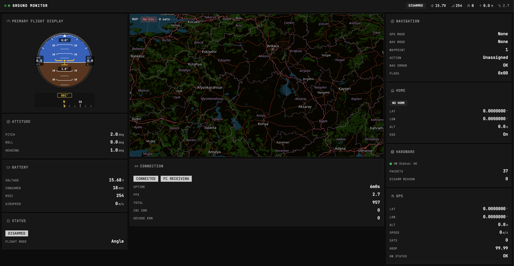

# FPV Ground Station

**Real-time FPV ground station with live telemetry dashboard**

[](https://go.dev)
[](LICENSE)
[]()

A budget-friendly, real-time FPV ground station built in Go with an embedded React web UI. Receives [LTM (Lightweight Telemetry)](#ltm-protocol) data over a serial connection and displays live flight data in the browser. Ships as a single binary — no external dependencies at runtime. Pair it with a couple of LoRa modules and a USB-TTL adapter for a complete long-range telemetry setup without expensive dedicated hardware.



## Features

- **Flight instruments** — attitude indicator (artificial horizon), heading compass, speed, and altitude
- **Interactive map** — live position tracking and flight path on OpenStreetMap (Leaflet)
- **Telemetry panels** — battery voltage, GPS status, navigation, home position, and sensor data
- **Connection stats** — frame rate (FPS), total frame count, CRC errors, uptime
- **Real-time updates** — WebSocket broadcast at 20 Hz (50 ms interval)
- **Single binary** — web UI is embedded at compile time, just run and open the browser

## How It Works

```
Flight Controller ──→ Serial (LTM) ──→ CLI ──→ Web Dashboard
```

1. **Serial port** — reads raw bytes from the serial connection (8N1, configurable baud rate)
2. **LTM parser** — state machine decodes the LTM byte stream into typed telemetry frames
3. **Telemetry store** — thread-safe in-memory store holds the latest state for each frame type
4. **Broadcast loop** — every 50 ms, the current telemetry snapshot is JSON-encoded and pushed to all connected WebSocket clients
5. **Web dashboard** — React app receives updates and renders flight instruments, map, and data panels

## Example Hardware Setup

```
                         Drone                                    Ground Station

┌────────────────────┐    UART   ┌──────────┐        ┌──────────┐  UART  ┌─────────┐  USB   ┌──────┐
│ Flight Controller  ├──────────→│ E22 LoRa │)))  (((│ E22 LoRa ├───────→│ USB/TTL │───────→│  PC  │
│ (INAV / Betaflight)│    LTM    └──────────┘   AIR  └──────────┘        └─────────┘        └──────┘
└────────────────────┘                                                                  fpv-ground-station
```

The flight controller outputs LTM on a spare UART. A pair of LoRa modules (e.g. EBYTE E22-900T) provides a long-range radio link. On the ground side, the LoRa module connects to the PC via a USB-to-TTL adapter. Ground Control reads from that serial port and serves the dashboard.

**Preferred E22 parameters:** 19200 baud rate with 19.2 kbps air data rate. This gives an optimal balance between range and latency for LTM telemetry.

This is just one example — any serial connection carrying LTM data will work (direct USB, Bluetooth serial, SiK radio, etc.).

## Quick Start

Download the latest binary from [Releases](https://github.com/ibrahimsn98/ground-control/releases), then:

```bash
./fpv-ground-station -port /dev/ttyUSB0 -baud 19200
```

Open [http://localhost:8080](http://localhost:8080) in your browser.

## Usage

```
fpv-ground-station [flags]
```

| Flag | Short | Default | Description |
|------|-------|---------|-------------|
| `--port` | `-p` | `/dev/cu.usbserial-840` | Serial port path |
| `--baud` | `-b` | `19200` | Baud rate |
| `--web` | | `:8080` | Web UI listen address |
| `--json` | | `false` | Output JSON lines to stdout |
| `--dev` | | `false` | Dev mode (proxy to Vite dev server) |

The `PORT` and `BAUD` environment variables can be used to override the default serial port and baud rate.

### Platform-Specific Serial Ports

| Platform | Example |
|----------|---------|
| macOS | `/dev/cu.usbserial-*` |
| Linux | `/dev/ttyUSB0`, `/dev/ttyACM0` |
| Windows | `COM3` |

## Building from Source

### Prerequisites

- [Go](https://go.dev/dl/) 1.25+
- [Bun](https://bun.sh/) (or Node.js) for building the web UI

```bash
git clone https://github.com/ibrahimsn98/ground-control.git
cd ground-control
make build
```

The binary is output to `bin/fpv-ground-station`.

## Supported Platforms

- **macOS** — primary development platform
- **Linux** — tested
- **Windows** — supported via Go cross-compilation

Any platform with Go 1.25+ and serial port support should work.

## Supported Protocols & Flight Controllers

### LTM (Lightweight Telemetry)

LTM is the only protocol currently supported. It is a lightweight, transmit-only telemetry protocol designed for low-bandwidth links.

| Flight Controller | LTM Support | Notes |
|-------------------|-------------|-------|
| **INAV** | Full | All 6 frame types (G, A, S, O, N, X). N and X frames are INAV extensions. |
| **Betaflight** | Partial | Supports core LTM frames. N/X frames are INAV-specific and may not be available. |
| **ArduPilot** | No | ArduPilot uses MAVLink natively. LTM is not available. |

## LTM Protocol

LTM uses a simple frame structure:

```
$  T  <function>  <payload...>  <checksum>
│  │      │            │             │
│  │      │            │             └─ XOR of payload bytes
│  │      │            └─ Variable length, little-endian
│  │      └─ Single byte: G, A, S, O, N, or X
│  └─ Header byte 2 (0x54)
└─ Header byte 1 (0x24)
```

### Frame Types

| Frame | Name | Payload | Frequency | Key Data |
|-------|------|---------|-----------|----------|
| **G** | GPS | 14 bytes | ~5 Hz | Latitude, longitude, ground speed, altitude, satellites, fix type |
| **A** | Attitude | 6 bytes | ~10 Hz | Pitch, roll, heading |
| **S** | Status | 7 bytes | ~5 Hz | Battery voltage, mAh drawn, RSSI, airspeed, armed/failsafe, flight mode |
| **O** | Origin | 14 bytes | ~1 Hz | Home latitude, longitude, altitude, fix |
| **N** | Navigation | 6 bytes | ~4 Hz | GPS mode, nav mode, nav action, waypoint number, nav error |
| **X** | Extended | 6 bytes | ~1 Hz | HDOP, hardware status, packet counter, disarm reason |

> **Note:** N (Navigation) and X (Extended) frames are INAV extensions and may not be present on other flight controller firmware.

### Baud Rate & LTM Update Rate

INAV supports three LTM update rates, allowing you to trade telemetry frequency for lower bandwidth (and potentially longer radio range):

| Setting | Data Rate | Min Baud | Use Case |
|---------|-----------|----------|----------|
| `NORMAL` | ~303 B/s | 4800 bps | Default — all frames at full rate |
| `MEDIUM` | ~164 B/s | 2400 bps | Reduced bandwidth |
| `SLOW` | ~105 B/s | 1200 bps | Maximum range (LoRa, low-speed links) |

Lower baud rates allow lower air-speed on radio links, which can increase range. LTM is transmit-only (no bidirectional communication required), so it works well on soft serial ports and simplex radio links.

## Flight Controller Configuration (INAV)

1. **Enable LTM on a spare UART** in INAV Configurator:
   - Go to the **Ports** tab
   - Find an available UART (e.g. UART3)
   - Enable **LTM** under the "Telemetry Output" column
   - Set the baud rate (19200 is a good default)

2**Adjust update rate** (optional):
   ```
   set ltm_update_rate = NORMAL
   save
   ```
   Use `MEDIUM` or `SLOW` for low-bandwidth links like LoRa.

### Project Structure

```
ground-control/
├── cmd/fpv-ground-station/  # Application entry point, embed logic
├── internal/
│   ├── ltm/                # LTM protocol parser and frame decoder
│   ├── serial/             # Serial port wrapper
│   ├── server/             # HTTP + WebSocket server
│   └── telemetry/          # Telemetry state store and stats
├── web-ui/                 # React + Vite + Tailwind dashboard
│   └── src/
│       ├── components/     # Dashboard, flight instruments, map, panels
│       ├── hooks/          # WebSocket telemetry hooks
│       ├── providers/      # Telemetry context provider
│       └── types/          # TypeScript type definitions
└── Makefile
```

### Running Tests

```bash
make test
```

## References

- [INAV LTM Wiki](https://github.com/iNavFlight/inav/wiki/Lightweight-Telemetry-(LTM)) — protocol specification and configuration details

## License

[Apache License 2.0](LICENSE)
